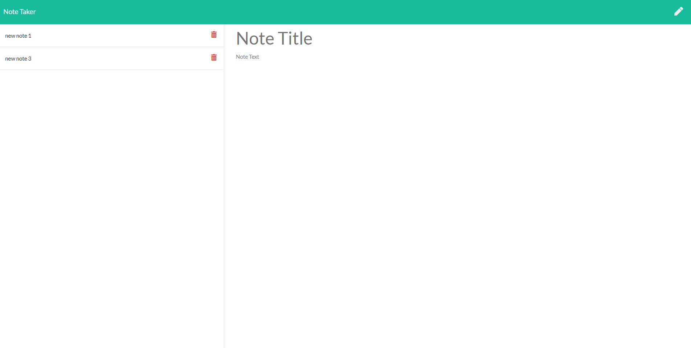

# EXPRESS-HOMEWORK-NOTE-TAKER

[GitHub Link](https://express-note-taker-move.herokuapp.com/notes)
[Deployed Application](https://express-note-taker-move.herokuapp.com/notes)

* [INTRODUCTION](#INTRODUCTION)
* [DEVELOPMENT](#DEVELOPMENT)
* [EXPRESS](#EXPRESS)
* [CONSIDERATIONS](#CONSIDERATIONS)

## INTRODUCTION

Developers & bootcampers have a hard enough time as it is being responsible for the creation and interaction for every aspect of a web application, so when it comes to building potentially repetitive and soul crushing amount of notes scribbled from many different sources into one convenient and online resource that we can add a limitless amount of notes to, edit those notes and delete them as necessary. 

Here we use Express & Heroku to have a host a note taker application that makes writing, editing and deleting notes on the fly, convenient & delightful.

## DEVELOPMENT

As with all of my projects, I created a process document where I walked through the basic functionality & goals for the application before writing any code. The main things that stuck out to me as far as initialization was to install EXPRESS & NODEMON, so I could host the project to my local machine before moving further.

As the front end interactivity was already built out, my only focus was to build out an efficient backend functionality that would allow a user to interact with our mock database file "db.json through a GET, POST & DELETE route.

## EXPRESS

Express is a powerful NPM package that allows us to begin backend functionality with javascript & to host our projects on external servers. This package and the syntax specific to it was critical in developing this project. 

## CONSIDERATIONS

There were a few hiccups in navigating this project that were amazing points of learning:

    1.  Middleware is critically important to linking of all assets to ensure that your project is running appropriately.
    2.  UUID, UUID is a great extension that helped me resolve an issue revolving around note id's & their targetting within the project for deletion.

## MANY THANKS
    Many thanks to my tutor for letting me work through my code during our sessions.